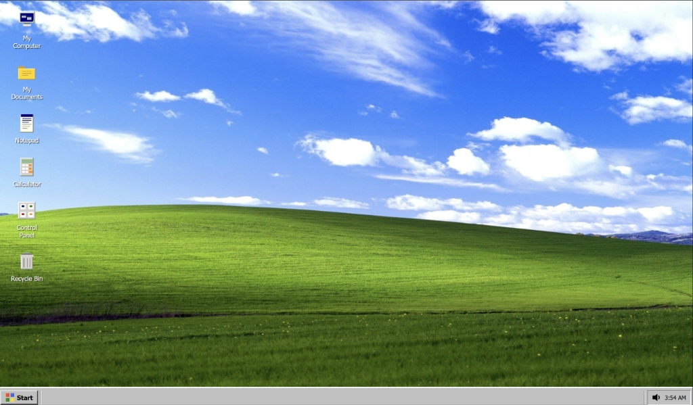
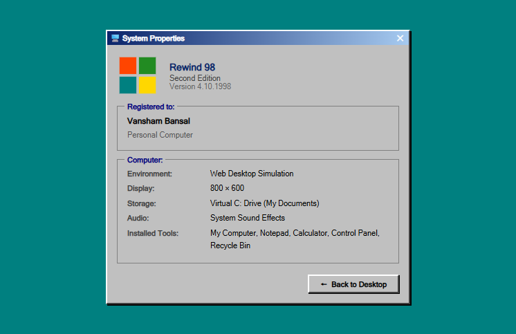

# REWIND: Retro Windows 98/2000 Operating System Simulation

An authentic, event-driven web simulation of the classic Windows 98/2000 graphical operating system built with Vanilla HTML5, CSS3, ES6 JavaScript Modules, IndexedDB (RewindFS), and the Web Audio API.



---

<a id="table-of-contents"></a>
## Table of Contents

- [1. Project Proposal](#project-proposal)
  - [1.1 Project Description](#project-description)
  - [1.2 Motivation and Objectives](#motivation-and-objectives)
  - [1.3 Project Goals](#project-goals)
  - [1.4 System Specifications](#system-specifications)
  - [1.5 System Design and Architecture](#system-design-and-architecture)
- [2. Implemented Features](#implemented-features)
- [3. Technical Architecture and Internals](#technical-architecture-and-internals)
- [4. Project Structure](#project-structure)
- [5. Getting Started and Local Execution](#getting-started-and-local-execution)
- [6. License and Credits](#license-and-credits)

---

<a id="project-proposal"></a>
## 1. Project Proposal

<a id="project-description"></a>
### 1.1 Project Description

REWIND is a full-featured web reproduction of the classic Windows 98/2000 graphical user interface and desktop environment. Developed from first principles using standard web technologies (HTML5, CSS3, and ES6 JavaScript Modules), REWIND recreates the core subsystems of a desktop operating system inside the browser window:

- A dynamic, multi-window desktop manager with drag-and-drop, minimize, maximize, and stacking order (z-index focus) capabilities.
- A virtual, hierarchical filesystem (RewindFS) backed by browser-native IndexedDB for persistent local storage of folders and files.
- A suite of retro productivity and management applications (My Computer / File Explorer, Notepad, 4-function Calculator, Control Panel, Recycle Bin).
- An authentic multi-page system architecture with a dedicated System Properties screen (system.html) integrated with the main desktop environment (index.html).
- A hardware-independent audio synthesis engine using the Web Audio API that generates authentic retro click, alert, and navigation sound effects algorithmically without external audio assets.

<a id="motivation-and-objectives"></a>
### 1.2 Motivation and Objectives

Modern web application development frequently relies on heavy abstractions, third-party frameworks, and complex build tooling. REWIND was conceived as a systems-level exploration of the browser as an application execution environment using pure, zero-dependency web standards:

1. **Operating System GUI Concepts**: Demonstrating how desktop operating systems handle window hierarchies, taskbar state synchronization, event bubbling, and desktop coordinate spaces.
2. **Client-Side Persistence**: Demonstrating non-volatile, hierarchical filesystem emulation in the browser using IndexedDB transactions.
3. **Multi-Page Architecture**: Implementing multi-page routing through dedicated pages (index.html and system.html) that share consistent design tokens and state models.
4. **Performance and Lightweight Footprint**: Achieving instant startup and sub-millisecond interaction latency with zero npm dependencies and zero frontend build steps.

<a id="project-goals"></a>
### 1.3 Project Goals

- **G1: Authentic Visual and Behavioral Emulation**: Faithfully replicate the classic Windows 98 aesthetic, bevelled 3D borders, system fonts (MS Sans Serif, Tahoma), taskbar tray, and Start Menu layouts.
- **G2: Robust Window Management Engine**: Implement a centralized WindowManager supporting non-overlapping dragging bounds, state toggling (minimized, maximized, restored), z-index depth layering, and modal system dialogs.
- **G3: True Filesystem Persistence**: Build RewindFS over IndexedDB to support complete Create, Read, Update, and Delete (CRUD) operations for files and directories across browser restarts.
- **G4: Two-Stage Deletion and Restoration**: Emulate the classic Recycle Bin with soft-delete marking and file restoration mechanics.
- **G5: Integrated System Customization**: Provide display settings inside a Control Panel with live CRT monitor wallpaper previewing and custom background uploads.
- **G6: Standalone Multi-Page Integration**: Deliver a dedicated system.html specifications page accessible directly from the Control Panel and desktop.

<a id="system-specifications"></a>
### 1.4 System Specifications

#### 1.4.1 Client Runtime Requirements

- **Browser**: Any modern web browser supporting ES6 Modules, HTML5 Canvas, IndexedDB, and Web Audio API (Google Chrome >= 80, Mozilla Firefox >= 75, Microsoft Edge >= 80, Safari >= 13.1).
- **Operating System**: Platform-independent (Windows 10/11, macOS, Linux).
- **Display Resolution**: Optimized for desktop viewports (1024 x 768 minimum recommended; fully responsive on higher resolutions).

#### 1.4.2 Software Technology Stack

| Layer | Technology | Rationale |
|---|---|---|
| Structure | HTML5 Semantic Markup | Clean layout separation with dedicated entry points (index.html, system.html). |
| Styling | Vanilla CSS3 (Custom Properties and 3D Bevels) | Precise retro box-shadow styling (#ffffff highlights, #808080 and #000000 shadows) without external CSS frameworks. |
| Logic | Vanilla JavaScript (ES6 Modules) | Native modularity with import and export across windowing, storage, desktop, and app components. |
| Storage Engine | IndexedDB API (RewindFS) | Structured, transaction-safe client-side persistent storage for directory nodes and files. |
| Configuration | LocalStorage API | Fast, synchronous key-value storage for user desktop preferences (active wallpaper). |
| Audio Synthesis | Web Audio API (AudioContext) | Algorithmic sound generation using oscillators and gain envelopes without relying on external audio files. |
| Static Host | Node.js Built-in http and fs Modules | Zero-dependency local static file host required by browser CORS rules for ES6 modules. |

---

<a id="system-design-and-architecture"></a>
### 1.5 System Design and Architecture

#### 1.5.1 High-Level Architecture Diagram

```
+-----------------------------------------------------------------------+
|                          WEB BROWSER RUNTIME                          |
+-----------------------------------------------------------------------+
|                                                                       |
|  +--------------------------+             +------------------------+  |
|  |  Main Desktop Workspace  | <=========> | System Properties Page |  |
|  |       (index.html)       | Navigation  |     (system.html)      |  |
|  +--------------------------+             +------------------------+  |
|              |                                                        |
|              v                                                        |
|  +-----------------------------------------------------------------+  |
|  |                        OS SUBSYSTEM CORE                        |  |
|  |  +-------------------+ +-------------------+ +----------------+ |  |
|  |  |   WindowManager   | |    Desktop UI     | | Taskbar & Tray | |  |
|  |  |  (Z-index, drag,  | | (Icons, selection | | (Clock, volume,| |  |
|  |  |   min/max bounds) | |  box, context)    | |  task buttons) | |  |
|  |  +-------------------+ +-------------------+ +----------------+ |  |
|  +-----------------------------------------------------------------+  |
|              |                                     |                  |
|              v                                     v                  |
|  +---------------------------------+  +----------------------------+  |
|  |        APPLICATION LAYER        |  |     HARDWARE EMULATION     |  |
|  |  - My Computer (File Explorer)  |  |  +-----------------------+ |  |
|  |  - Notepad (Text Editor/Export) |  |  |     SoundManager      | |  |
|  |  - Calculator (Arithmetic/Mem)  |  |  | (Web Audio Synthesis) | |  |
|  |  - Control Panel (Wallpapers)   |  |  +-----------------------+ |  |
|  |  - Recycle Bin (Soft Delete)    |  |  - Click / Beep / Asterisk |  |
|  +---------------------------------+  +----------------------------+  |
|              |                                                        |
|              v                                                        |
|  +-----------------------------------------------------------------+  |
|  |                    PERSISTENT STORAGE LAYER                     |  |
|  |    +------------------------+     +------------------------+    |  |
|  |    |  RewindFS (IndexedDB)  |     |  LocalStorage Settings |    |  |
|  |    | (Virtual C: hierarchy) |     | (Wallpaper/Preferences)|    |  |
|  |    +------------------------+     +------------------------+    |  |
|  +-----------------------------------------------------------------+  |
+-----------------------------------------------------------------------+
```

#### 1.5.2 Subsystem Breakdown

1. **Window Management Subsystem (windowManager.js)**:
   - Maintains an internal registry of active window instances.
   - Calculates dynamic z-index layering on window focus and click.
   - Handles mouse event coordinate offsets for smooth dragging while constraining windows within desktop boundaries.
   - Synchronizes window state (open, active, minimized) directly with taskbar buttons.

2. **Virtual Filesystem Engine (storage.js and filesystem.js)**:
   - Manages an IndexedDB object store with hierarchical nodes containing id, parentId, name, type (file vs folder), content, size, createdAt, and isDeleted.
   - On first boot, seeds an authentic C: drive structure with default directories (My Documents, Program Files, Windows) and starter documents.
   - Exposes asynchronous operations for directory listing, file reading, file writing, folder creation, and deletion.

3. **Audio Synthesis Engine (soundManager.js)**:
   - Uses a shared singleton AudioContext.
   - Creates short, non-blocking frequency bursts with configured waveform types (sine, square) and gain decay envelopes.
   - Includes user interaction resume logic to adhere to modern browser autoplay policies.

4. **Multi-Page System Module (system.html)**:
   - Provides a dedicated standalone page documenting system configuration, registered user info, display parameters, and installed components.
   - Offers clean, relative URL navigation (href="./") to return instantly to the desktop session.

---

<a id="implemented-features"></a>
## 2. Implemented Features

### Desktop and Interface
- **Classic Desktop Grid**: Displays desktop shortcuts with authentic icons, labels, and single-click highlight states.
- **Rubberband Drag Selection**: Click and drag across the desktop backdrop to draw a translucent selection rectangle that highlights icons within its bounding box.
- **Right-Click Context Menu**: Custom context menu on desktop click with options to open apps, refresh, and inspect properties.
- **Classic Shutdown Sequence**: Shutdown dialog and full-screen retro "It is now safe to turn off your computer" screen.

### Taskbar and System Tray
- **Start Menu**: Classic vertical layout with retro sidebar branding ("Rewind 98") and shortcuts to all applications.
- **Task Synchronization**: Each open application creates a dedicated taskbar button that depresses when focused and toggles minimize or restore on click.
- **Live System Tray Clock**: Updates every second with current local time. Clicking the clock opens an interactive monthly calendar popup.
- **System Volume Mixer**: Volume icon in the system tray opens a popover volume slider that modulates the SoundManager master gain.

### My Computer (File Explorer)
- Hierarchical folder tree navigation with back/forward history and interactive address bar.
- Displays folders and text files stored in IndexedDB.
- Supports inline creation of new text files and subfolders.
- Double-clicking a text file directly launches Notepad with that file loaded.

### Notepad
- Full multi-line text editor with title bar filename reflection.
- Open existing files from RewindFS and save changes directly back to IndexedDB.
- Dirty state tracking (prompts to save changes when closing modified files).
- Native file download: Export documents as real .txt files to the user's physical machine.

### Calculator
- Faithful reproduction of the standard 4-function Windows Calculator.
- Arithmetic operations: Addition, subtraction, multiplication, division, square root, percentage, reciprocal (1/x).
- Memory registers: Memory Clear (MC), Memory Recall (MR), Memory Store (MS), and Memory Add (M+).
- Full physical keyboard input support (number keys, arithmetic operators, Enter, Backspace, Escape).

### Recycle Bin
- True soft-delete mechanism: Deleted files in My Computer are flagged with isDeleted: true instead of being permanently removed.
- Recycle Bin window allows users to inspect deleted items, restore them to their original directory, or permanently purge them.
- Dynamic desktop icon: Automatically switches between empty and full Recycle Bin icons depending on whether deleted items exist in storage.

### Control Panel and Display Properties
- Tabbed configuration dialog featuring Background and System tabs.
- **Wallpaper Customizer**: Choose between classic retro teal, tiled patterns, and photographic wallpapers with a live preview inside a rendered miniature CRT monitor.
- **Custom Photo Upload**: Allows users to select an image from their local machine, converts it to a base64 Data URL, and immediately applies it as the active wallpaper (persisted via localStorage).
- **Direct System Properties Link**: Bridges the desktop directly to the multi-page system screen.

### System Properties (system.html)
- A dedicated standalone HTML document showcasing operating system specifications, registration information, display resolution, and virtual storage status.
- Clean, relative URL navigation allowing zero-friction switching between the desktop and system details.



---

<a id="technical-architecture-and-internals"></a>
## 3. Technical Architecture and Internals

### Window Management Lifecycle

```
[User Click / Shortcut]
       |
       v
WindowManager.createWindow(config)
       |
       +--> Generates DOM: .window > .title-bar + .window-body
       +--> Appends taskbar button via Taskbar.addTask()
       +--> Attaches drag handlers to .title-bar
       +--> Attaches control buttons: Minimize, Maximize, Close
       +--> Sets active z-index focus and plays sound effect
```

### IndexedDB Virtual Storage Schema (RewindFS)

- **Database Name**: RewindFS
- **Version**: 1
- **Object Store**: nodes (key: id)
- **Index**: parentId (enables O(1) child directory queries)

```javascript
interface FSNode {
    id: string;          // Example: "node_1696000000_abc"
    parentId: string;    // "root" or parent folder id
    name: string;        // Example: "Readme.txt"
    type: 'file' | 'folder';
    content?: string;    // UTF-8 file content
    size: number;        // in bytes
    createdAt: number;   // Epoch timestamp
    updatedAt: number;   // Epoch timestamp
    isDeleted: boolean;  // Soft delete flag for Recycle Bin
}
```

---

<a id="project-structure"></a>
## 4. Project Structure

```
Rewind/
|-- .gitignore
|-- LICENSE
|-- README.md
|-- favicon.svg
|-- index.html
|-- system.html
|-- server.js
|
|-- assets/
|   |-- images/
|   |   `-- wallpapers/
|   |       |-- landscape.png
|   |       `-- landscape1.png
|   `-- screenshots/
|       |-- desktop.png
|       `-- system_properties.png
|
|-- css/
|   |-- reset.css
|   |-- desktop.css
|   |-- windows.css
|   |-- taskbar.css
|   |-- menus.css
|   `-- applications.css
|
`-- js/
    |-- app.js
    |-- desktop.js
    |-- taskbar.js
    |-- startMenu.js
    |-- contextMenu.js
    |-- windowManager.js
    |-- storage.js
    |-- filesystem.js
    |-- soundManager.js
    |-- icons.js
    |
    `-- apps/
        |-- myComputer.js
        |-- notepad.js
        |-- calculator.js
        |-- controlPanel.js
        `-- recycleBin.js
```

---

<a id="getting-started-and-local-execution"></a>
## 5. Getting Started and Local Execution

### 5.1 Architecture Note: Why a Local Static Server?

REWIND is a 100% client-side (frontend-only) web application with zero backend databases or server-side logic.

Modern web browsers enforce strict security standards (the Same-Origin / CORS policy) that disallow loading native ES6 JavaScript modules (`<script type="module">` with `import`/`export`) over the `file:///` protocol (such as double-clicking an HTML file from Windows Explorer). To load modular JavaScript files, browsers require an HTTP origin (`http://localhost` or `http://127.0.0.1`).

To keep the project lightweight and dependency-free, a minimal 50-line static server script (`server.js`) is provided using only Node.js's built-in standard library (`http`, `fs`, `path`). It requires no `npm install` and no external packages.

### 5.2 Running the Project

You can run REWIND using any standard static hosting method:

#### Method 1: Using the Included Node.js Server (Recommended)
No `npm install` or third-party packages are needed. Simply run:
```bash
node server.js
```
Then navigate to:
```
http://127.0.0.1:3000
```
*(Or `http://localhost:3000`)*.

#### Method 2: Using Python Built-in HTTP Server
If you prefer running without Node.js, Python can serve the files directly:
```bash
python -m http.server 3000
```
Then navigate to `http://127.0.0.1:3000`.

#### Method 3: Using VS Code Live Server Extension
Open the project directory in VS Code, right-click `index.html`, and select **Open with Live Server**.

---

<a id="license-and-credits"></a>
## 6. License and Credits

- **Author**: [Vansham Bansal](https://github.com/vanshambansal)
- **License**: This project is licensed under the MIT License (see the [LICENSE](LICENSE) file for details).
- **Design Inspiration**: Classic Microsoft Windows 98 / 2000 Operating Systems.
